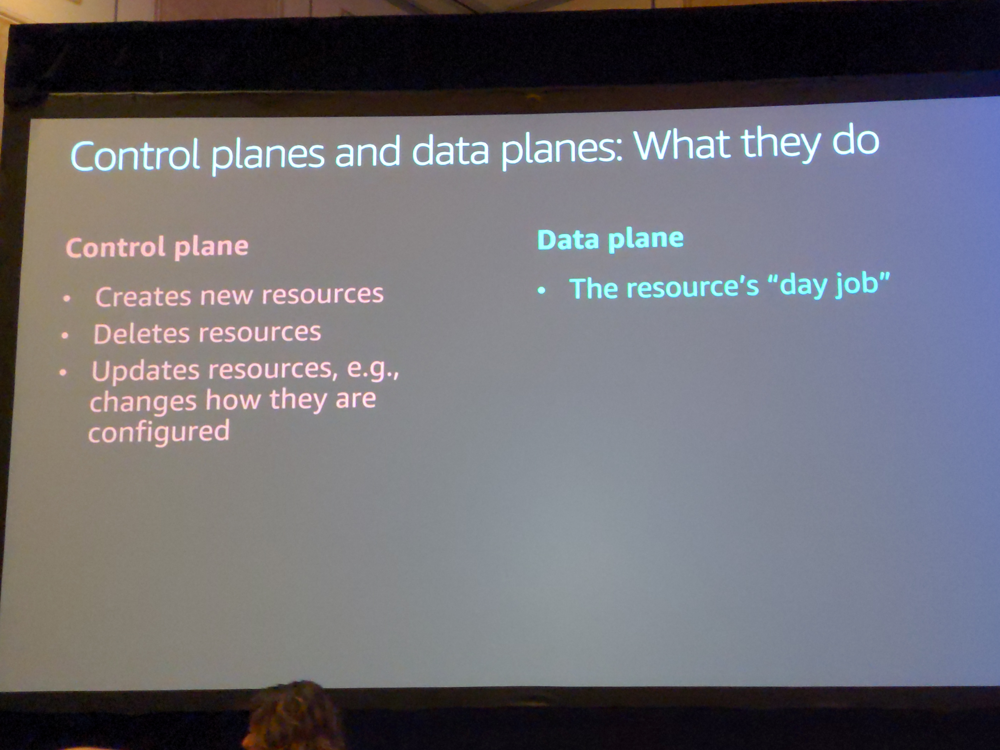
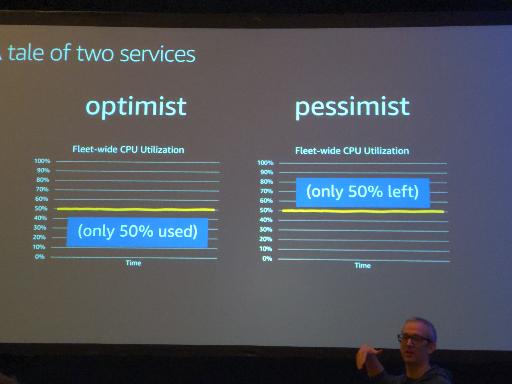
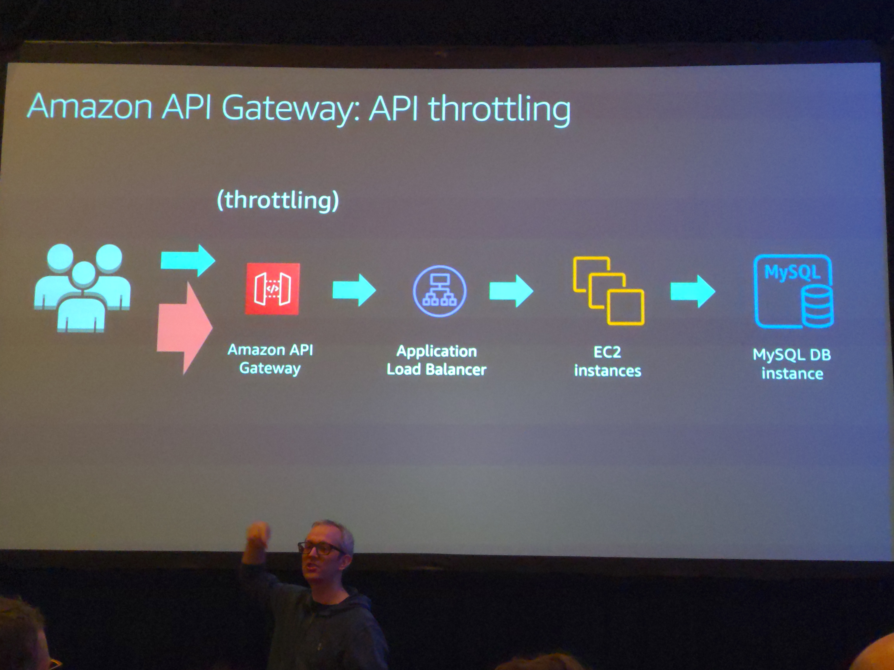
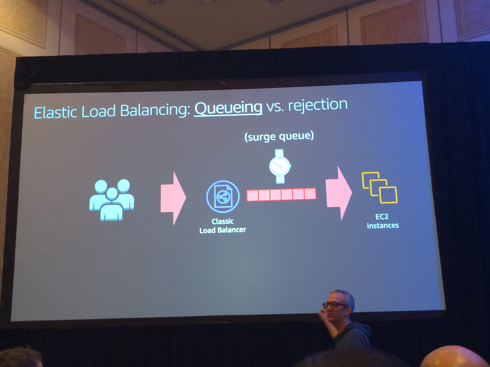

# AWS Failure Handling Through Resiliance

## Control planes and data planes

Data planes : day job

Control plane: crud ops for the data plane

Machine is the control plane, execution is the data plane???

Most think ctl plane fails more

Presenters of opinion data-plane is more vital than control-plane

## Static Stability

Continued stability and availability in the face of impaired dependencies

Dependency != Destiny

## Exampl
Consider System1(S1) and System2(S2)

S1 depends on data from S2

S2 gives S1 data, S1 transforms data

Define failure conditions

S2 should have a higher availability target than S1

S1 should only depend on the data plane of S2 not the control plane

Sometimes your data plane can depend on another ctl plane though (oh noes)

Control planes and data planes can be considered to be different systems (build agent is a ctl plane for ec2 in its own special way)

Should try to have ctl planes call ctl planes and data planes call data planes

Cloud formation is a ctl plane that calls other ctl planes without depending on data planes

If S1 needs higher avail than S2, S1 should have an awareness of the data it needs in S1. If S2 crashes or has a bad day, S1 may get stale or static data but it won't fail because S2 did. (See second pic) that's static stability.

Have S2 inject that data, instead of being polled for it.

This is some more overhead for the data to be injected, in cost and complexity

Sometimes the left side of second pic is more reliable. The right side has some consistency issues in its model. If S2 is down then data can become inconsistent between 1 and 2 (lambda updates, fargate ec2 ). Propefation takes time. So eventual consistency happens when decoupling data and control plane. 

The build agent auto deployment (old and new) is a good example of this.

Having a db updated with data is an acceptable approach for this data info instead of querying S2 repeatedly

Aws will push back more on increasing ctl plane avail over increasing data plane avail for customers

Avoiding Overloading:

Be pessemistic  

Lots of unplanned stuff can happen, and a cpu can't run at 100% really

Amdal's Law

> Amdahl's law (or Amdahl's argument[1]) is a formula which gives the theoretical speedup in latency of the execution of a task at fixed workload that can be expected of a system whose resources are improved.

If expected rsp time is 50ms and 100ms once you hit that contention point it doesn't matter if it works or not, clients will retry and exasperate the issue (Reddit hug of death)

You should obsess with how much headroom you have (we do see Marc's podcast in our provisioning)

Points in the system that take longer to scale need more head room to compensate

ie a mysql db vs ec2 instances

Throttelling to the capacity of your slowest scaling is possible

Access for some is better than access for none because of latency issues

Failure is constrained to one point instead of cascading failure for everything in throttling as well

Set expectations (a single user has a capacity of requests over time and know that). This allows you to have predictable overhead requirements

Concurrency limits helps too (but isn't that just a form of throtelling)

You need layers of protection, so throttling and concurrency help two different issues. 

Don't queue during overload  - oh hey we do that!

Old requests get stale and can become garbage (TTL for queue entries???)

Should always consider how fast a queue is drained naturally by the system

Sometimes requeueing old messages to a different queue (backlog queue) is a viable method so newer messages can be processed (keeps avg response time down)

