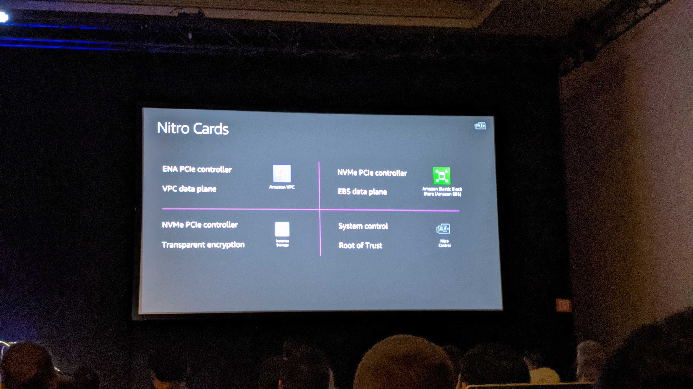
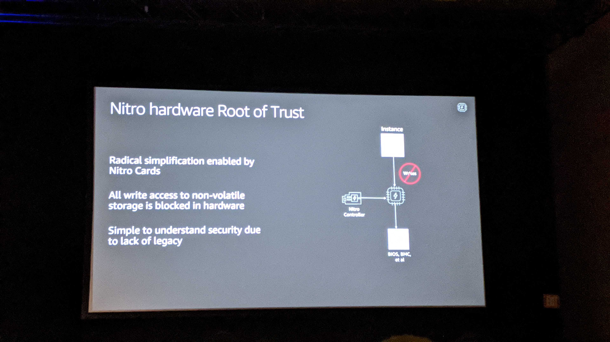
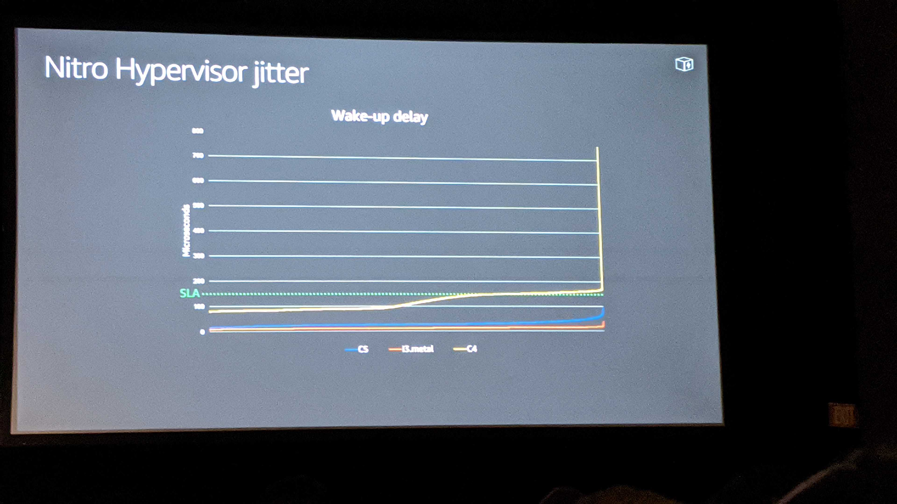

# Managing EC2 Fleet with Nitro

## Related Sessions
CMP334
CMP322
CMP302
CMP321
CMP338
CMP310

## Nitro Launch

launched 2 years ago in dev since 2013

purpose built hardware/software

hypervisor built for AWS

All new instances launched since 2017 use the nitro system

## What is Nitro System

### Nitro Cards

* vpc networking
* ebs
* instance storage
* system controller

Nitro cards for vpc, storage, system control/ trust root, EBS (see pic)

#### VPC

This is the network card (NIC)

drivers for al lmajor os
independent of fabric

##### VPC data plane

* Encapsulation
* Security Groups
* Limiters
* Routing

This was introduced to unify their network hardware, this is the *Elastic Network Interface* 

automagically makes networking work with any instnace, at the promised bandwidth

the card itself implements the list above.

#### EBS

This is the NVMe controller which has standard drivers everywhere

##### EBS Data Plane

Supports Encryption
NVM to remote storage protocol

Since this is netwokr attached storage it handles the NVm to remot storage protocol
packet processing is offloaded to the card
Encryption is handled in hardware (<3)

#### Instance storage

This is the NVMe controller again
Handles encrpytion, monitoring, limiters, and transparent encryption

the advent of 10g networks made spinning storage less apealing

the advent of ssd made network storage less appealing

the limiter handles the disk monitoring for wear and alerts the client

#### System control

provides passive api endpoint

cooridinates with othern itro cards

coordinates with nitron hypervisor

cooridinates with nitro security chip

hardware root of trust

### Nitro Security chip

* integrated to mobo
* protects hareware resources
* hardware root of trust

custom microcontroller tha ttraps all IO to non volatile storage

controllable from the notrio controller to hold system boot

provides simple hardware root of trust.

This sanitizes the bios on the bm instances

radical simplify root of trust by nitro cards

see pic

### Nitro Hypervisor

* lightweight hypervisor 

* memory and cpu allocation 

* bare metal-like performance 

This will trap writes to things like the Flash

kvm based with custom mm and small user space

only executes on behalf of instance

makes the HV very simple

the only time it does something is if the instance asks it to do something

this is also done in hardware????? Is it a hardware hypervisor? (yes)

It's thanks to this that you get the full machine for virtual instances, and don't have resources eaten by the hyper visor

see picture for jitter 

the spike at end of picture, is because the SSM mode of the bios where it starts stealing cycles for it's own thing (c4)

the c5  instance has super low over head, and it's near constant, it has the same BIOS theft spike

## Continuous Innovation Via Nitro

Cascade lake cpu

enabled 100gbps networking deplowment

with low latency message passing

nitro hardware and softare can be in tour datacenter (Oooo can we use it on our mac vms??)

### Elastic Fabric Adapter

Integrated with libfabric

scalable reliable datagram protocol (SRD)

user space and kernel space available on virtualized and bare metal instances

2019: EFA on c5n.18xlarge, p3dn.24xlarge

EFA allows libfrabic to have access to kernel space so kernel mode drivers can be implemented to talk directly to hardware for some pass through (noice)

## Managin the EC2 fleet with nitro

a purpose built service that allow them to deploy software quckly and safely

most virtualization software stack has been offloaded t the nitro cards

nictrocards can be updated with no distruption to customer instances

works for virtualzed and bare metal servers with no hypervisor

velocity control and strict scheduling - only one AZ in a region per day

software deployed in controlled fashion to avoid low things
